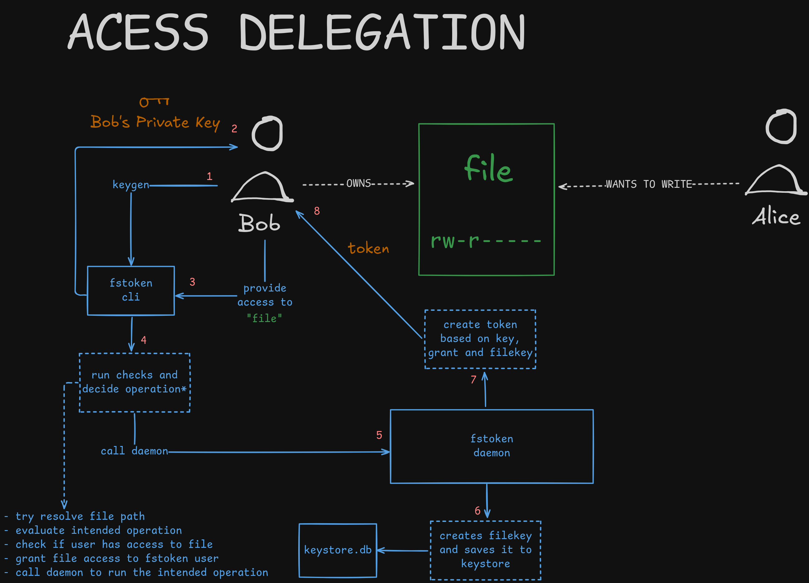
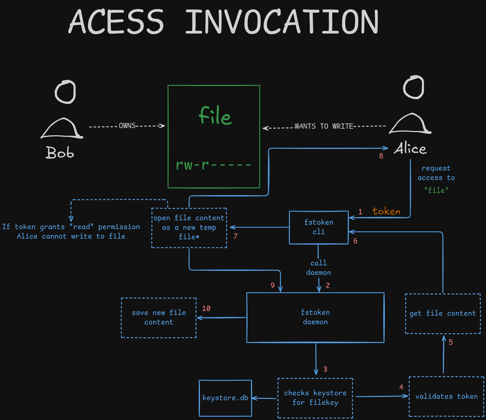

# fstoken 

An easy to use linux filesystem tool enabling a semi capability-based access control to files.

## Motivation

Access control represents a very important, yet challenging, feature of reliable and secure systems, designing and implementing such must be taken into account when building multi-user applications. [ACLs](https://en.wikipedia.org/wiki/Access-control_list) and [RBAC](https://en.wikipedia.org/wiki/Role-based_access_control), although consolidated alternatives, may not be good choices for distributed applications and non-client/server systems. Therefore, a novel approach may be needed. This project is a case study inspired by [UCAN](https://github.com/ucan-wg), a decentralized, capability-based authorization token, which rethinks the regular ACL-based approach by bringing authorization as closest as possible to the resources and resource owners (users).

This is an implementation trial of semi capability-based access control within regular filesystems. The present application may or may not be expanded or generalized to work with distributed applications and handle different computational objects rather than regular files.

## Access delegation flow

## Access invocation flow

